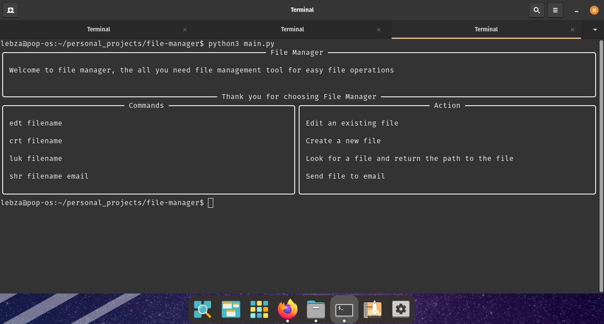

# File Manager

File Manager CLI Tool

## Overview
File Manager CLI Tool is a command line tool that provides useful file operations. While not a command tool (in development :), it offers operations like creating files, editing files, locating files and deleting files.

## Features
- Create new files -> in development for Linux os
- Locate files -> in development for Linux os
- Delete files -> in development for Linux os
- Share files on the browser -> in development

## Usage
To run File Manager, follow these steps:
- Clone the project
- Navigate to the project directory in your terminal or command prompt
- Navigate to the `text_operations` folder
- To run any module, use the command: `python <module_name.py>`

## Screenshots

## Installation
- Python 3
- Additional dependencies: fpdf, rich

## Future Plans
In the future, I plan to:
- Make the entire project a command-line application
- Add Linux support
- Implement speech recognition for executing operations

## Contributors
- Austin - kngobeni223@gmail.com
